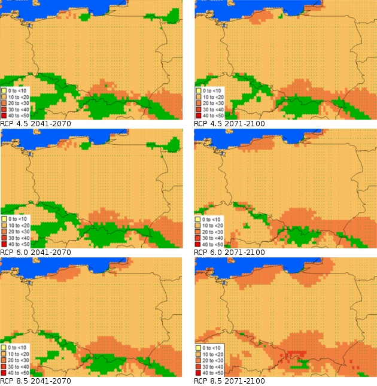

# (PART) Wstęp {-}

**Powód wykonania PRA:** *Helicoverpa zea* jest gatunkiem rozprzestrzenionym w strefach tropikalnych, subtropikalnych i umiarkowanych obu Ameryk. Gąsienica żeruje polifagicznie na wielu gatunkach roślin, zarówno dzikich, jak i uprawnych. W Ameryce Północnej powoduje ona znaczne straty w uprawie, między innymi kukurydzy i soi. Ponieważ motyle potrafią migrować na
znaczne odległości, gąsienice są spotykane również w regionach, gdzie gatunek ten nie jest w stanie przezimować. Istnieje ryzyko zawleczenia tego gatunku do Europy, gdzie będzie mógł się dalej rozprzestrzeniać samoistnie.

**Obszar PRA:** Rzeczpospolita Polska

# (PART) Ocena zagrożenia Agrofagiem {-}

(@) Taksonomia:

* Królestwo: Animalia

* Typ: Arthropoda

* Podtyp: Hexapoda

* Gromada: Insecta

* Rząd: Lepidoptera

* Rodzina: Noctuidae

* Rodzaj: *Helicoverpa*

* Gatunek: *Helicoverpa zea* (Boddie, 1850)*

Na podstawie: @eppo2018

**Synonimy:** *Heliothis zea* (Boddie, 1850), *Phalaena zea* (Boddie, 1850), *Bombyx obsoleta* Fabricius 1775, *Heliothis umbrosa* Grote

**Nazwa powszechna:** American bollworm, corn earworm, tomato fruitworm, New World bollworm (angielska), Chenille des épis du maïs (francuska), Amerikanischer Baumwollkapselwurm (niemiecka)

(@) Informacje ogólne o agrofagu:

*Helicoverpa zea* jest gatunkiem rozpowszechnionym na obu kontynentach amerykańskich, o dużych skłonnościach migracyjnych. Szczegółowe informacje o tym gatunku dostępne są na stronach (@eppo2018, @cabieppo2017) oraz stronach @cabi2017. Dużo informacji o biologii i szkodliwości można znaleźć także na stronach University of Florida @capinera2000. 

Gąsienice żerują polifagicznie na wielu gatunkach roślin z różnych rodzin, jednak największe straty ekonomiczne przynoszą szkody wyrządzane w uprawach kukurydzy. Larwy mogą żerować na większości organów nadziemnych roślin, zjadając i dziurawiąc liście jak, i wgryzając się do wnętrza pędów, owoców oraz kolb kukurydzy. Gatunek ten najłatwiej wykryć w stadium gąsienicy, są one jednak dość zmiennie ubarwione i istnieje możliwość pomyłki z innymi przedstawicielami rodziny sówkowatych (Noctuidae). Typowo ubarwiona gąsienica ma ciemny grzbiet ciała (zwykle brązowy) z czarnymi pinaculami, jaśniejszy pasek po bokach ciała i jasny spód ciała (barwy od cielistej, przez żółtą do zielonej). Szczegóły budowę larw można znaleźć w kluczu, który opracował Passoa [-@passoa2014], @lepintercept2017.

Ponieważ gąsienice zazwyczaj wgryzają się do wnętrza organów roślin to by je znaleźć trzeba często rozciąć pęd czy kolbę kukurydzy. Na podstawie gąsienicy jest bardzo trudno stwierdzić czy mamy do czynienie z *H. zea*, czy też z występującą w Polsce *H. armigera*. Gąsienice należy zebrać i wyhodować postaci dorosłe, których identyfikacja jest możliwa na podstawie budowy aparatów kopulacyjnych. Osobniki dorosłe mogą być także odławiane do pułapek świetlnych i feromonowych @capinera2000.

(@) Czy agrofag jest wektorem?

**Nie**

(@) Czy do wejścia lub rozprzestrzenienia agrofaga potrzebny jest wektor.

**Nie**

(@) Status regulacji agrofaga:

```{r echo = F, eval = T}
Q5 <- read.csv('categorization.csv',
               header = T,
               stringsAsFactors = F)
if (knitr::is_html_output()) {
kable(Q5, col.names = c('Kontynent/Region',
                        'Kraj/RPPP',
                        'Status',
                        'Rok')) %>%
  kable_styling(full_width = T, bootstrap_options = c('striped', 'condensed', 'bordered')) %>%
  row_spec(row = 0, bold = T, background = '#f5f6fa') %>%
  column_spec(1, width = '10em') %>%
  column_spec(4, width = '8em') %>%
  collapse_rows(columns = 1:2, valign = "middle")
}  else {
  kable(Q5, 'latex', booktabs = T, longtable = T,
        col.names = c(col.names = c('Kontynent/Region',
                                    'Kraj/RPPP',
                                    'Status',
                                    'Rok'))) %>%
    kable_styling(full_width = T,
                  latex_options = c('hold_position', 'repeat_header')) %>%
    column_spec(1, width = '4cm') %>%
    column_spec(4, width = '2.5cm') %>%
    row_spec(row = 0, bold = T, background = '#F5F6FA') %>%
    collapse_rows(columns = 1:2, latex_hline = "major", valign = "middle")
}
```

(@) Rozmieszczenie:

```{r echo = F, eval = T}
Q6 <- read.csv('distribution.csv',
               header = T,
               stringsAsFactors = F)

if (knitr::is_html_output()) {
kable(Q6, col.names = c('Kontynent',
                        'Rozmieszczenie',
                        'Komentarz do statusu agrofaga w poszczególnych krajach',
                        'Źródła')) %>%
  kable_styling(full_width = T, bootstrap_options = c('striped', 'condensed', 'bordered')) %>%
  row_spec(row = 0, bold = T, background = '#f5f6fa') %>%
  column_spec(1, width = '9em') %>%
  column_spec(c(2,3), width = '15em') %>%
  column_spec(4, width = '10em') %>%
  collapse_rows(columns = 1:2, valign = "middle")
}  else {
  Q6L <- Q6$Zrodlo
  
  Q6L <- Q6L %>%
    gsub('@', '', .) %>%
    strsplit('; ') %>%
    lapply(formatingCite) %>%
    lapply(paste, collapse = '; ') %>% 
    unlist %>% 
    data.frame(Zrodla = .) %>% 
    bind_cols(Q6, .) %>%
    select(-'Zrodlo')
  Q6L$Zrodla[Q6L$Zrodla == '\\citeauthor{}, \\hyperlink{ref-}{\\citeyear{}}'] <- NA
  kable(Q6L, 'latex', booktabs = T, longtable = T,
        col.names = c('Kontynent', 'Rozmieszczenie',
                      'Komentarz do statusu agrofaga w poszczególnych krajach',
                      'Źródła'), escape = F) %>%
    kable_styling(full_width = T,
                  latex_options = c('hold_position', 'repeat_header')) %>%
    column_spec(1, width = '2.5cm') %>%
    column_spec(c(2,3), width = '4.5cm') %>%
    column_spec(4, width = '3cm') %>%
    row_spec(row = 0, bold = T, background = '#F5F6FA') %>%
    collapse_rows(columns = 1:2, latex_hline = "major", valign = "middle")
}
```

(@) Rośliny żywicielskie i ich rozmieszczenie na obszarze PRA:

```{r echo = F, eval = T}
Q7 <- read.csv('hosts.csv',
               header = T,
               stringsAsFactors = F)
if (knitr::is_html_output()) {
kable(Q7, col.names = c('Nazwa naukowa szkodnika (nazwa powszechna)',
               'Obecność na obszarze PRA',
               'Komentarze',
               'Źródła')) %>%
  kable_styling(full_width = T, bootstrap_options = c('striped', 'condensed', 'bordered')) %>%
  row_spec(row = 0, bold = T, background = '#f5f6fa') %>%
  column_spec(1:2, width = '15em') %>%
  column_spec(4, width = '12em')
} else {
  Q7L <- Q7$Zrodlo
  
  Q7L <- Q7L %>%
    gsub('@', '', .) %>%
    strsplit('; ') %>%
    lapply(formatingCite) %>%
    lapply(paste, collapse = '; ') %>% 
    unlist %>% 
    data.frame(Zrodla = .) %>% 
    bind_cols(Q7, .) %>%
    select(-'Zrodlo')
  Q7L$Zrodla[Q7L$Zrodla == '\\citeauthor{}, \\hyperlink{ref-}{\\citeyear{}}'] <- NA
  Q7L$Nazwa_szkodnika <- Q7L$Nazwa_szkodnika %>%
    gsub("(\\*[A-Z]*[a-z]*\\s*[a-z]*\\*)","\\\\textit{\\1}", .) %>%
    gsub("\\*", '',.)
  kable(Q7L, 'latex', booktabs = T, longtable = T,
    col.names = c('Nazwa naukowa szkodnika (nazwa powszechna)',
               'Obecność na obszarze PRA',
               'Komentarze',
               'Źródła'), escape = F) %>%
    kable_styling(full_width = T,
                  latex_options = c('hold_position', 'repeat_header')) %>%
    row_spec(row = 0, bold = T, background = '#F5F6FA') %>%
    column_spec(1, width = '3.5cm') %>%
    column_spec(2, width = '2.5cm') %>%
    column_spec(4, width = '3cm')
}
```

(@) Drogi przenikania: 

Najbardziej prawdopodobne jest przenikanie gatunku w stadium jaja, gąsienicy lub poczwarki. Mogą być one zawlekane z:

* roślinami do sadzenia (z wyłączeniem nasion, bulw i cebulek) z lub bez podłoża
* częściami roślin i produktami roślinnym, takimi jak:
    + kwiaty cięte i gałęzie,
    + cięte drzewa,
    + owoce i warzywa.

W wypadku rozwinięcia się na terenie Europy osiadłej populacji H. zea, gatunek ten będzie mógł się rozprzestrzeniać dalej drogą naturalnej migracji. Istnieje także możliwość przedostania się osobników dorosłych z transportem lotniczym, zwłaszcza
z terenów, gdzie gatunek ten występuje w dużej liczebności (np. Ameryka Środkowa).

```{r echo = F, eval = T}
Q8A <- read.csv('pathwaysA.csv',
               header = T,
               stringsAsFactors = F, allowEscapes = T)

if (knitr::is_html_output()) {
  kable(Q8A, col.names = c('Możliwa droga przenikania',
                           'Droga przenikania:')) %>%
    kable_styling(full_width = T,
                  bootstrap_options = c('striped', 'condensed', 'bordered')) %>%
    row_spec(row = 0, bold = T, background = '#F5F6FA') %>%
    column_spec(1, width = '22em')
} else {
  Q8A[, 2] <- Q8A[, 2] %>%
    gsub("(\\*[A-Z]*\\.*[a-z]*\\s*[a-z]*\\*)","\\\\textit{\\1}", .) %>%
    gsub("\\*", '',.)
  kable(Q8A, 'latex', booktabs = T, longtable = T,
        col.names = c('Możliwa droga przenikania',
                      'Droga przenikania:'), escape = F) %>%
    kable_styling(full_width = T,
                  latex_options = c('hold_position', 'repeat_header')) %>%
    row_spec(row = 0, bold = T, background = '#F5F6FA') %>%
    row_spec(row = 1:11, bold = F) %>%
    column_spec(1, width = '7cm') %>%
    collapse_rows(columns = 1, latex_hline = "major", valign = "top")
}
```

```{r echo = F, eval = T}
Q8B <- read.csv('pathwaysB.csv',
               header = T,
               stringsAsFactors = F, allowEscapes = T)

if (knitr::is_html_output()) {
  kable(Q8B, col.names = c('Możliwa droga przenikania',
                           'Droga przenikania:')) %>%
    kable_styling(full_width = T,
                  bootstrap_options = c('striped', 'condensed', 'bordered')) %>%
    row_spec(row = 0, bold = T, background = '#F5F6FA') %>%
    column_spec(1, width = '22em')
} else {
  Q8B[, 2] <- Q8B[, 2] %>%
    gsub("(\\*[A-Z]*\\.*[a-z]*\\s*[a-z]*\\*)","\\\\textit{\\1}", .) %>%
    gsub("\\*", '',.)
  kable(Q8B, 'latex', booktabs = T, longtable = T,
        col.names = c('Możliwa droga przenikania',
                      'Droga przenikania:'), escape = F) %>%
    kable_styling(full_width = T,
                  latex_options = c('hold_position', 'repeat_header')) %>%
    row_spec(row = 0, bold = T, background = '#F5F6FA') %>%
    row_spec(row = 1:11, bold = F) %>%
    column_spec(1, width = '7cm') %>%
    collapse_rows(columns = 1, latex_hline = "major", valign = "top")
}
```

```{r echo = F, eval = T}
Q8C <- read.csv('pathwaysC.csv',
               header = T,
               stringsAsFactors = F, allowEscapes = T)

if (knitr::is_html_output()) {
  kable(Q8C, col.names = c('Możliwa droga przenikania',
                           'Droga przenikania:')) %>%
    kable_styling(full_width = T,
                  bootstrap_options = c('striped', 'condensed', 'bordered')) %>%
    row_spec(row = 0, bold = T, background = '#F5F6FA') %>%
    column_spec(1, width = '22em')
} else {
  Q8C[, 2] <- Q8C[, 2] %>%
    gsub("(\\*[A-Z]*\\.*[a-z]*\\s*[a-z]*\\*)","\\\\textit{\\1}", .) %>%
    gsub("\\*", '',.)
  kable(Q8C, 'latex', booktabs = T, longtable = T,
        col.names = c('Możliwa droga przenikania',
                      'Droga przenikania:'), escape = F) %>%
    kable_styling(full_width = T,
                  latex_options = c('hold_position', 'repeat_header')) %>%
    row_spec(row = 0, bold = T, background = '#F5F6FA') %>%
    row_spec(row = 1:11, bold = F) %>%
    column_spec(1, width = '7cm') %>%
    collapse_rows(columns = 1, latex_hline = "major", valign = "top")
}
```

(@) Prawdopodobieństwo zasiedlenia w warunkach zewnętrznych (środowisko naturalne i zarządzane oraz uprawy) na obszarze PRA:

W obecnych warunkach klimatycznych nie ma możliwości rozwinięcia się stałych populacji *H. zea* w Polsce. Ponieważ jest to gatunek migrujący, w wypadku powstania licznych populacji w Europie Południowej, istnieje możliwość czasowej kolonizacji i wyrządzania szkód przez gąsienice, jak ma to miejsce w północnych stanach USA i południowej Kanadzie. Blisko spokrewniony z *H. zea* gatunek -- *H. armigera*, jest już notowany w Polsce jako szkodnik kukurydzy, jednak pojawiający się niezbyt licznie i bez większego znaczenia ekonomicznego.

Model niszy klimatycznej agrofaga został opracowny w programie CLIMEX 4.0 @csiro2004. Ze względu na słabą dostępność danych wymaganych do modelowania wykorzystano parametry niszy klimatycznej blisko spokrewnionego gatunku *H. amigera* @zalucki2005, które następnie korygowano o informacje dotyczące diapauzy i wymagań temperaturowych @olmstead2016. W kolejnym etapie modelowania dopasowywano poszczególne parametry wilgotności oraz temperatury inicjującej i terminującej diapauzę, tak aby wynik odzwierciedlał rozmieszczenie owada na terenie Ameryki Północnej (Załącznik 1 Tab 4). Ze względu na obecność agrofaga na obszarze Kalifornii modelowanie przeprowadzano z założeniem irygacji 3,6 mm/dzień (25 mm/tydzień, patrz @mika2010). Modelowanie przeprowadzono na danych historycznych z okresu referencyjnego 1961-1990. Następnie użyto zunifikowanych danych z okresu 1986-2015 jako zmiany klimatycznej w stosunku do okresu referencyjnego do określenia bieżących warunków klimatycznych panujących na obszarze PRA.

```{r echo = F, eval = T}
Q9 <- data.frame(Ocena = c('Ocena prawdopodobieństwa zadomowienia w warunkach zewnętrznych',
                            'Ocena niepewności'),
                 Niskie = c('X','.'),      #wstawić X w odpowiedni poziom pomiędzy ''
                 Średnie = c('.','X'),     #pierwsze miejsce dla prawdopodobieństwa, drugie
                 Wysokie = c('.','.'), stringsAsFactors = F)      #dla niepewności
if (knitr::is_html_output()) {
 kable(Q9, align = c('l', 'c', 'c', 'c')) %>%
  kable_styling(full_width = T, bootstrap_options = c('condensed', 'bordered')) %>%
  row_spec(row = 0, bold = T, background = '#f5f6fa') %>%
  column_spec(2:4, width = '8em', bold = T) %>%
  row_spec(1:2, color = 'black', background = '#f5d0b8')
} else {
  Q9 %>%
    dplyr::mutate_all(linebreak) %>%
    kable(align = c("l", "c", "c", "c"), booktabs = T, escape = F) %>%
    kable_styling(full_width = T,
                  latex_options = c('hold_position')) %>%
    row_spec(row = 0, bold = T, background = '#F5F6FA') %>%
    column_spec(1, width = '8cm') %>%
    row_spec(1:2, color = 'black', background = '#F0AE82')
}
```

Z dancyh historycznych za okres 1961-1990 wynika, że warunki panujące na terenie PRA nie są dogodne dla agrofaga. Jednak na podstawie modelu zmiany klimatu jaka nastąpiła w okresie 1986-2015 można ze średnią niepewnością stwierdzić, że zmiany temperatury i opadów jakie nastąpiły w ostatnim trzydziestoleciu umożliwiają zasiedlenie agrofaga w niektórych obszarach kraju. Ponadto należy zauważyć, że gatunek posiada ogromne możliwości dyspersyjne, przez co możliwe są jego masowe naloty na obszar PRA przy sprzyjających warunkach atmosferycznych (patrz pkt 11). Z drugiej strony gatunek ten na terenie Europy ma konkurencję w postaci blisko spokrewnionego *H. amigera* przez co ocena możliwości jego zasiedlenia jest utrudniona.

(@) Prawdopodobieństwo zasiedlenia w uprawach pod osłonami na obszarze PRA:

Jako polifag *H. zea* może rozwijać się na wielu roślinach, w tym uprawianych w szklarniach roślinach ozdobnych i warzywach. Dla spokrewnionego gatunku, *H. armigera*, notowano w Europie liczne wystąpienia w warunkach upraw chronionych
([PRA Helicoverpa amigera](https://secure.fera.defra.gov.uk/phiw/riskRegister/downloadExternalPra.cfm?id=3879)). Ponieważ w warunkach upraw pod osłonami gatunek ten jest dość łatwy do wykrycia i zwalczenia (duże gąsienice), a prawdopodobieństwo przenoszenia jest niewielkie, nie należy spodziewać się rozwinięcia populacji utrzymujących się przez dłuższy czas.

```{r echo = F, eval = T}
Q10 <- data.frame(Ocena = c('Ocena prawdopodobieństwa zasiedlenia w uprawach chronionych',
                            'Ocena niepewności'),
                 Niskie = c('X','.'),      #wstawić X w odpowiedni poziom pomiędzy '' 
                 Średnie = c('.','X'),     #pierwsze miejsce dla prawdopodobieństwa, drugie
                 Wysokie = c('.','.'), stringsAsFactors = F)     #dla niepewności (patrz przykład  pyt.9)
if (knitr::is_html_output()) { 
kable(Q10, align = c('l', 'c', 'c', 'c')) %>%
  kable_styling(full_width = T, bootstrap_options = c('bordered')) %>%
  row_spec(row = 0, bold = T, background = '#f5f6fa') %>%
  column_spec(2:4, width = '8em', bold = T) %>%
  row_spec(1:2, color = 'black', background = '#f5d0b8')
} else {
  Q10 %>%
    dplyr::mutate_all(linebreak) %>%
    kable(align = c("l", "c", "c", "c"), booktabs = T, escape = F) %>%
    kable_styling(full_width = T,
                  latex_options = c('hold_position')) %>%
    row_spec(row = 0, bold = T, background = '#F5F6FA') %>%
    column_spec(1, width = '8cm') %>%
    row_spec(1:2, color = 'black', background = '#F0AE82')
}
```

(@) Rozprzestrzenienie na obszarze PRA:

Motyle H. zea mają duże zdolności dyspersyjne i mogą pokonywać dystans przekraczający kilkaset kilometrów. W takim wypadku rozprzestrzenianie z udziałem człowieka ma znaczenie marginalne. Gatunek ten posiada ogromne możliwości dyspersyjne. Duże populacje motyli potrafią migrować na wysokości nawet 900 m. n. p. m. na odległości przekraczające 400 km. Dlatego, mimo że aktualnie warunki pogodowe na terenie PRA raczej nie są korzystne do zasiedlenia możliwe są naloty owada z pobliskich krajów, w których warunki sprzyjają zasiedleniu (np. z Węgier). Taka sytuacja ma miejsce w natywnym zasięgu na terenie USA, gdzie uważa się, że osobniki znajdywane na północy (powyżej 40 równoleżnika) nie tworzą stałych populacji, i prawdopodobnie na zimę migrują na południe (patrz przegląd literatury w @olmstead2016).

```{r echo = F, eval = T}
Q11 <- data.frame(Ocena = c('Ocena wielkości rozprzestrzenienia na obszarze PRA',
                            'Ocena niepewności'),
                 Niskie = c('X','X'),      #wstawić X w odpowiedni poziom pomiędzy '' 
                 Średnie = c('.','.'),     #pierwsze miejsce dla prawdopodobieństwa, drugie
                 Wysokie = c('.','.'), stringsAsFactors = F)     #dla niepewności (patrz przykład  pyt.9)
if (knitr::is_html_output()) {
kable(Q11, align = c('l', 'c', 'c', 'c')) %>%
  kable_styling(full_width = T, bootstrap_options = c('condensed', 'bordered')) %>%
  row_spec(row = 0, bold = T, background = '#f5f6fa') %>%
  column_spec(2:4, width = '8em', bold = T) %>%
  row_spec(1:2, color = 'black', background = '#f5d0b8')
} else {
  Q11 %>%
    dplyr::mutate_all(linebreak) %>%
    kable(align = c("l", "c", "c", "c"), booktabs = T, escape = F) %>%
    kable_styling(full_width = T,
                  latex_options = c('hold_position')) %>%
    row_spec(row = 0, bold = T, background = '#F5F6FA') %>%
    column_spec(1, width = '8cm') %>%
    row_spec(1:2, color = 'black', background = '#F0AE82')
}
```

(@) Wpływ na obcecnym obszarze zasięgu:

  I) Wpływ na bioróżnorodność

Na obszarach, gdzie *H. zea* występuje licznie, może być ona istotnym elementem sieci troficznych. Dorosłe osobniki mogą stanowić ważny element diety niektórych gatunków ptaków, nietoperzy. Stadia preimaginalne mogą być zjadane przez drapieżne owady oraz owadożerne ssaki. Są one także ważnym miejscem rozwoju parazytoidów. Pełną listę naturalnych wrogów *H. zea* podaje Kogan i in. [-@kogan1989].

```{r echo = F, eval = T}
Q12_01 <- data.frame(Ocena = c('Ocena wielkości wpływu na bioróżnorodność na obecnym obszarze zasięgu',
                               'Ocena niepewności'),
                 Niskie = c('.','.'),      #wstawić X w odpowiedni poziom pomiędzy '' 
                 Średnie = c('X','X'),     #pierwsze miejsce dla prawdopodobieństwa, drugie
                 Wysokie = c('.','.'), stringsAsFactors = F)     #dla niepewności (patrz przykład  pyt.9)
if (knitr::is_html_output()) {
kable(Q12_01, align = c('l', 'c', 'c', 'c')) %>%
  kable_styling(full_width = T, bootstrap_options = c('condensed', 'bordered')) %>%
  row_spec(row = 0, bold = T, background = '#f5f6fa') %>%
  column_spec(2:4, width = '8em', bold = T) %>%
  row_spec(1:2, color = 'black', background = '#f5d0b8')
} else {
    Q12_01 %>%
      dplyr::mutate_all(linebreak) %>%
      kable(align = c("l", "c", "c", "c"), booktabs = T, escape = F) %>%
      kable_styling(full_width = T,
                    latex_options = c('hold_position')) %>%
      row_spec(row = 0, bold = T, background = '#F5F6FA') %>%
      column_spec(1, width = '8cm') %>%
      row_spec(1:2, color = 'black', background = '#F0AE82')
}
```

  II) Wpływ na usługi ekosystemowe
  
Na obecnym obszarze występowania *H. zea* jest jednym z najistotniejszych szkodników kukurydz oraz drugim co do istotności ekonomicznej szkodnikiem w ogóle @cabi2017. Znaczne straty wyrządzane są także w uprawie bawełny, sorgo, pomidorów i wielu innych roślin.

```{r echo = F, eval = T}
Q12_02 <- read.csv('eco_services.csv',
               header = T,
               stringsAsFactors = F)

if (knitr::is_html_output()) {
kable(Q12_02, col.names = c('Usługi ekosystemowe',
                            'Czy szkodnik wpływa na tą usługę ekosystemową?',
                            'Krótki opis wpływu',
                            'Źródła')) %>%
  kable_styling(full_width = T, bootstrap_options = c('striped', 'condensed', 'bordered')) %>%
  row_spec(row = 0, bold = T, background = '#f5f6fa') %>%
  column_spec(1, width = '10em') %>%
  column_spec(c(2,4), width = '12em')
} else {
  Q12_02L <- Q12_02$Zrodlo
  
  Q12_02L <- Q12_02L %>%
    gsub('@', '', .) %>%
    strsplit('; ') %>%
    lapply(formatingCite) %>%
    lapply(paste, collapse = '; ') %>% 
    unlist %>% 
    data.frame(Zrodla = .) %>% 
    bind_cols(Q12_02, .) %>%
    select(-'Zrodlo')
  Q12_02L$Zrodla[Q12_02L$Zrodla == '\\citeauthor{}, \\hyperlink{ref-}{\\citeyear{}}'] <- NA
  Q12_02L[, 3] <- Q12_02L[, 3] %>%
    gsub("(\\*[A-Z]*\\.*[a-z]*\\s*[a-z]*\\*)","\\\\textit{\\1}", .) %>%
    gsub("\\*", '',.)
  kable(Q12_02L, booktabs = T, longtable = T,
        col.names = c('Usługi ekosystemowe',
                      'Czy szkodnik wpływa na tą usługę ekosystemową?',
                      'Krótki opis wpływu',
                      'Źródła'), escape = F) %>%
  kable_styling(full_width = T, latex_options = c('hold_position', 'repeat_header')) %>%
  row_spec(row = 0, bold = T, background = '#F5F6FA') %>%
  column_spec(1, width = '3cm') %>%
  column_spec(c(2,4), width = '3.5cm')
}
```

```{r echo = F, eval = T}
Q12_02A <- data.frame(Ocena = c('Ocena wielkości wpływu na usługi ekosystemowe na obecnym obszarze zasięgu',
                                'Ocena niepewności'),
                 Niski = c('.','X'),      #wstawić X w odpowiedni poziom pomiędzy '' 
                 Średni = c('.','.'),     #pierwsze miejsce dla prawdopodobieństwa, drugie
                 Wysoki = c('X','.'), stringsAsFactors = F)     #dla niepewności (patrz przykład  pyt.9)
if (knitr::is_html_output()) {
 kable(Q12_02A, align = c('l', 'c', 'c', 'c')) %>%
  kable_styling(full_width = T, bootstrap_options = c('condensed', 'bordered')) %>%
  row_spec(row = 0, bold = T, background = '#f5f6fa') %>%
  column_spec(2:4, width = '8em', bold = T) %>%
  row_spec(1:2, color = 'black', background = '#f5d0b8')
} else {
    Q12_02A %>%
      dplyr::mutate_all(linebreak) %>%
      kable(align = c("l", "c", "c", "c"), booktabs = T, escape = F) %>%
      kable_styling(full_width = T,
                    latex_options = c('hold_position')) %>%
      row_spec(row = 0, bold = T, background = '#F5F6FA') %>%
      column_spec(1, width = '8cm') %>%
      row_spec(1:2, color = 'black', background = '#F0AE82')
}
```

  III) Wpływ socjo-ekonomiczny

Szacunkowe straty powodowane przez *H. zea* (razem z *H. virescens*) na terenie USA szacowane są na 1000 milionów USD rocznie. Koszty ochrony chemicznej upraw to dodatkowo ok. 250 mln USD rocznie @cabi2017.

```{r echo = F, eval = T}
Q12_03 <- data.frame(Rating = c('Ocena wielkości wpływu socjoekonomicznego na obecnym obszarze zasięgu',
                               'Ocena niepewności'),
                 Niski = c('.','X'),      #wstawić X w odpowiedni poziom pomiędzy '' 
                 Średni = c('.','.'),     #pierwsze miejsce dla prawdopodobieństwa, drugie
                 Wysoki = c('X','.'), stringsAsFactors = F)     #dla niepewności (patrz przykład  pyt.9)
if (knitr::is_html_output()) {
 kable(Q12_03, align = c('l', 'c', 'c', 'c')) %>%
  kable_styling(full_width = T, bootstrap_options = c('condensed', 'bordered')) %>%
  row_spec(row = 0, bold = T, background = '#f5f6fa') %>%
  column_spec(2:4, width = '8em', bold = T) %>%
  row_spec(1:2, color = 'black', background = '#f5d0b8')
} else {
    Q12_03 %>%
      dplyr::mutate_all(linebreak) %>%
      kable(align = c("l", "c", "c", "c"), booktabs = T, escape = F) %>%
      kable_styling(full_width = T,
                    latex_options = c('hold_position')) %>%
      row_spec(row = 0, bold = T, background = '#F5F6FA') %>%
      column_spec(1, width = '8cm') %>%
      row_spec(1:2, color = 'black', background = '#F0AE82')
}
```

(@) Potencjalny wpływ na obszarze PRA:

Czy wpływ będzie równie duży, co na obecnym obszarze występowania? *Nie*

Ze względu na uwarunkowania klimatyczne *H. zea* nie jest w stanie wytworzyć na terenie naszego kraju osiadłych populacji. Ponieważ jest to gatunek migrujący, w wypadku powstania dużych populacji w południowej Europie istnieje możliwość, że migrujące osobniki będą licznie docierać na terytorium Polski i ze składanych jaj rozwiną się gąsienice, które lokalnie będą mogły wyrządzać znaczne szkody, zwłaszcza w uprawach kukurydzy.

  I) Potencjalny wpływ na bioróżnorodność na obszarze PRA

Małe prawdopodobieństwo powstanie osiadłych populacji *H. zea* na terenie PRA. Dodatkowo nisza ekologiczna jest już tutaj zajęta przez bliźniaczy gatunek -- *H. armigera*.

**Jeżeli Nie,**

```{r echo = F, eval = T}
Q13_01 <- data.frame(Ocena = c('Ocena wielkości wpływu na bioróżnorodność na potencjalnym obszarze zasiedlenia',
                               'Ocena niepewności'),
                 Niski = c('X','X'),      #wstawić X w odpowiedni poziom pomiędzy '' 
                 Średni = c('.','.'),     #pierwsze miejsce dla prawdopodobieństwa, drugie
                 Wysoki = c('.','.'), stringsAsFactors = F)     #dla niepewności (patrz przykład  pyt.9)
if (knitr::is_html_output()) {
kable(Q13_01, align = c('l', 'c', 'c', 'c')) %>%
  kable_styling(full_width = T, bootstrap_options = c('condensed', 'bordered')) %>%
  row_spec(row = 0, bold = T, background = '#f5f6fa') %>%
  column_spec(2:4, width = '8em', bold = T) %>%
  row_spec(1:2, color = 'black', background = '#f5d0b8')
} else {
    Q13_01 %>%
      dplyr::mutate_all(linebreak) %>%
      kable(align = c("l", "c", "c", "c"), booktabs = T, escape = F) %>%
      kable_styling(full_width = T,
                    latex_options = c('hold_position')) %>%
      row_spec(row = 0, bold = T, background = '#F5F6FA') %>%
      column_spec(1, width = '8cm') %>%
      row_spec(1:2, color = 'black', background = '#F0AE82')
}
```

 II) Potencjalny wpływ na usługi ekosystemowe na obszarze PRA

Brak.
**Jeżeli Nie,**

```{r echo = F, eval = T}
Q13_02 <- data.frame(Ocena = c('Ocena wielkości wpływu na usługi ekosystemowe na potencjalnym obszarze zasiedlenia',
                               'Ocena niepewności'),
                 Niski = c('X','.'),      #wstawić X w odpowiedni poziom pomiędzy '' 
                 Średni = c('X','.'),     #pierwsze miejsce dla prawdopodobieństwa, drugie
                 Wysoki = c('.','.'), stringsAsFactors = F)     #dla niepewności (patrz przykład  pyt.9)
if (knitr::is_html_output()) {
 kable(Q13_02, align = c('l', 'c', 'c', 'c')) %>%
  kable_styling(full_width = T, bootstrap_options = c('condensed', 'bordered')) %>%
  row_spec(row = 0, bold = T, background = '#f5f6fa') %>%
  column_spec(2:4, width = '8em', bold = T) %>%
  row_spec(1:2, color = 'black', background = '#f5d0b8')
} else {
    Q13_02 %>%
      dplyr::mutate_all(linebreak) %>%
      kable(align = c("l", "c", "c", "c"), booktabs = T, escape = F) %>%
      kable_styling(full_width = T,
                    latex_options = c('hold_position')) %>%
      row_spec(row = 0, bold = T, background = '#F5F6FA') %>%
      column_spec(1, width = '8cm') %>%
      row_spec(1:2, color = 'black', background = '#F0AE82')
}
```

 III) Potencjalny wpływ socjoekonomiczny na obszarze PRA

Gatunek ten może na obszarze PRA tworzyć, jako migrant, jedynie efemeryczne populacje, których liczebność może się znacznie wahać w poszczególnych latach, dlatego wpływ ten jest bardzo trudny do oszacowania.
**Jeżeli Nie,**

```{r echo = F, eval = T}
Q13_03 <- data.frame(Ocena = c('Ocena wielkości wpływu socjoekonomiczny na potencjalnym obszarze zasiedlenia',
                               'Ocena niepewności'),
                 Niski = c('X','.'),      #wstawić X w odpowiedni poziom pomiędzy '' 
                 Średni = c('.','.'),     #pierwsze miejsce dla prawdopodobieństwa, drugie
                 Wysoki = c('.','X'), stringsAsFactors = F)     #dla niepewności (patrz przykład  pyt.9)
if (knitr::is_html_output()) {
 kable(Q13_03, align = c('l', 'c', 'c', 'c')) %>%
  kable_styling(full_width = T, bootstrap_options = c('condensed', 'bordered')) %>%
  row_spec(row = 0, bold = T, background = '#f5f6fa') %>%
  column_spec(2:4, width = '8em', bold = T) %>%
  row_spec(1:2, color = 'black', background = '#f5d0b8')
} else {
    Q13_03 %>%
      dplyr::mutate_all(linebreak) %>%
      kable(align = c("l", "c", "c", "c"), booktabs = T, escape = F) %>%
      kable_styling(full_width = T,
                    latex_options = c('hold_position')) %>%
      row_spec(row = 0, bold = T, background = '#F5F6FA') %>%
      column_spec(1, width = '8cm') %>%
      row_spec(1:2, color = 'black', background = '#F0AE82')
}
```

(@) Identyfikacja zagrożonego obszaru:

Obecnie zagrożone są tereny w Polsce zachodniej i północno-zachodniej oraz stosunkowo niewielkie obszary w centralnej (okolice Kutna) i wschodniej części kraju (części województw mazowieckiego i świętokrzyskiego). Potencjalnie największego wpływu można spodziewać się w zachodniej części kraju, co związane jest z klimatem, strukturą upraw (znaczny udział kukurydzy w areale zasiewów) oraz łatwością przenikania (bak istotnych barier środowiskowych i geograficznych).

(@) Zmiana kliamtu:

Oprogramowanie CLIMEX umożliwia modelowanie zmiany niszy w odpowiedzi na zmianę klimatu na dwa sposoby. Pierwszym jest użycie odpowiednio sformatowanych danych klimatycznych wyliczonych na podstawie modeli klimatycznych. Drugim jest użycie zunifikowanych, globalnych wartości zmiany temperatury i opadów dla okresów letniego i zimowego, bezpośrednio w programie. Ze względu na małą dostępność danych klimatycznych, w odpowiednim dla programu CLIMEX formacie i trudności związanych z transformowaniem tego typu danych, do predykcji niszy użyto dwóch zestawów danych pochodzących z bazy CliMond -- CSIRO-MK3.0 i MIROC-H. W obu przypadkach przyszły klimat oszacowany został na podstawie scenariuszy SRES: A2 i A1B dla lat 2050 i 2100 @kriticos2012. Oba scenariusze zakładają, że gospodarka światowa będzie się rozwijać z większym naciskiem na wartości ekonomiczne niż środowiskowe. Do wyznaczenia zunifikowanych wartości zmiany temperatury i opadów w okresie letnim i zimowym w okresach 2041-2070 i 2071-2100 użyto od 12 do 27 modeli w zależności od scenariusza (RCP 4.5, 6.0, 8.5) i szacowanego parametru (patrz załącznik 1). Na podstawie predykcji z każdego modelu wyznaczono średnią zmianę parametru dla obszaru PRA.

Źródła niepewności:

W przypadku użycia zagregowanych danych klimatycznych pochodzących z bazy CliMond największym źródłem niepewności jest wiarygodność wyników symulacji uwzględniającej wąski zakres możliwych projekcji rozwoju gospodarczego i związanych z nim zmian oraz możliwych okresowych wahań klimatu. Przyjęcie zagregowanych wartości z wielu globalnych modeli cyrkulacji atmosfery pozwala na przyjęcie bardziej wiarygodnej projekcji zmian klimatu, redukując tym samym zakres niepewności. Jednak użycie jednej wartości dla całego regionu powoduje niedoszacowanie lub przeszacowanie wartości parametrów w poszczególnych podregionach. Co więcej, należy zauważyć, że największe zmiany klimatu w przypadku obszaru PRA zachodzą w zimowej porze roku. Dlatego uśrednione wartości temperatury i opadu dla okresu zimowego, w skład, którego wchodzą pory roku jesienna i zimowa, obarczone są błędem. W przypadku zmian opadów niepewność predykcji jest ogólnie wysoka, co wynika z samego charakteru słabej przewidywalności tego parametru klimatu. W przypadku *H. zea* ważnym czynnikiem wpływającym na przeżycie poczwarek agrofaga jest temperatura i wilgotność podłoża. Poczwarki są w stanie przeżyć w temperaturze poniżej 0 °C , o ile wilgotność podłoża pozostaje niska. W przypadku Polski, wg szacunków, zarówno temperatura jak i opad (a zatem wilgotność podłoża) zmienią się dużo bardziej w okresie zimowym niż w jesiennym. Dlatego uśrednienie tych parametrów może niedoszacowywać stresu środowiskowego oddziałującego na agrofaga.

```{r heliothisp1, echo=FALSE, fig.cap="Indeks ekoklimatyczny dla H. zea w latach 2050 i 2100 na podstawie scenariuszy A1B i A2; model MIROC-H", out.width = '100%', fig.pos='H'}

```

```{r heliothisp2, echo=FALSE, fig.cap="Indeks ekoklimatyczny dla H. zea w latach 2041-2070 i 2071-2100 dla scenariuszy RCP 4.5; 6.0 i 8.5", out.width = '100%'}

```

  I) Który scenariusz zmiany klimatu jest uwzględniony na lata 2050 do 2100

Scenariusz zmiany klimatu: RCP 4.5, 6.0, 8.5, SRES: A2, A1B (@ipcc2014)

  II) Rozważyć wpływ projektowanej zmiany klimatu na agrofaga.

Zmiany klimatyczne nie wpłyną na możliwości przenikania gatunku na obszar PRA – już w istniejących uwarunkowaniach klimatycznych jest ono teoretycznie możliwe. Mogą one jednak oddziaływać na ich częstotliwość w wypadku rozwinięcia się osiadłych populacji w pobliżu Polski (np. północne Węgry, południe Czech). Według przyjętych modeli klimatycznych w roku 2050 ponad połowa terytorium Polski będzie obszarem potencjalnego zasiedlenia przez *H. zea*, a w roku 2100 praktycznie cały obszar naszego kraju (z wyjątkiem wyższych partii gór) będzie spełniał warunki dla rozwoju tego agrofaga. Ze względu na trudność prognozowania warunków klimatycznych w okresie zimowym, nie można w tej chwili jednoznacznie ustalić, czy w rozpatrywanym okresie powstaną dogodne warunki do rozwinięcia się osiadłych populacji *H. zea*.

```{r echo = F, eval = T}
Q15_03 <- read.csv('changes.csv',
               header = T,
               stringsAsFactors = F)
if (knitr::is_html_output()) {
kable(Q15_03, col.names = c('Wpływ zmian klimatu na',
                            'Zmiana',
                            'Źródła')) %>%
  kable_styling(full_width = T, bootstrap_options = c('striped', 'condensed', 'bordered')) %>%
  row_spec(row = 0, bold = T, background = '#f5f6fa') %>%
  column_spec(1, width = '24em') %>%
  column_spec(c(3), width = '10em')
} else {
  Q15_03L <- Q15_03$Zrodlo
  
  Q15_03L <- Q15_03L %>%
    gsub('@', '', .) %>%
    strsplit('; ') %>%
    lapply(formatingCite) %>%
    lapply(paste, collapse = '; ') %>% 
    unlist %>% 
    data.frame(Zrodla = .) %>% 
    bind_cols(Q15_03, .) %>%
    select(-'Zrodlo')
  Q15_03L$Zrodla[Q15_03L$Zrodla == '\\citeauthor{}, \\hyperlink{ref-}{\\citeyear{}}'] <- NA
  kable(Q15_03L, booktabs = T, longtable = T,
        col.names = c('Wpływ zmian klimatu na',
                      'Zmiana',
                      'Źródła'), escape = F) %>%
  kable_styling(full_width = T, latex_options = c('hold_position', 'repeat_header')) %>%
  row_spec(row = 0, bold = T, background = '#F5F6FA') %>%
  column_spec(1, width = '5.5cm') %>%
  column_spec(3, width = '3.5cm')
}
```

(@) Ogólna ocena ryzyka:

Prawdopodobieństwo zawleczenia *H. zea* do Europy jest bardzo wysokie – w Wielkiej Brytanii wielokrotnie notowano gąsienice przywożone wraz z importowanym materiałem roślinnym (EPPO). Identyfikację zagrożenia ułatwia fakt, że ślady żerowania gąsienic są zwykle dobrze widoczne i stosunkowo łatwe do wykrycia przez służby fitosanitarne. Same larwy mogą jednak w różny sposób ukrywać się na roślinach, między innymi wgryzając się do wnętrza łodyg, pędów, owoców itp. Dlatego też materiał roślinny sprowadzany z obszaru występowania agrofaga powinien być zawsze poddawany wnikliwej kontroli, a w razie potrzeby również kwarantannie lub dezynsekcji. W naszych warunkach dotyczy to głównie okresu wiosenno-letniego, kiedy to larwy mogłyby dokończyć rozwój w warunkach polowych. W przypadku materiału roślinnego sprowadzanego do uprawy w warunkach chronionych, niezbędna jest całoroczna szczegółowa inspekcja fitosanitarna Wnikliwa inspekcja powinna mieć także miejsce w krajach regionu śródziemnomorskiego, gdzie gatunek ten może już obecnie zaaklimatyzować się do warunków polowych.

# (PART) Zarządzanie ryzykiem zagrożenia agrofagiem. {-}

(@) Środki fitosanitarne

  I) Opisać potencjalne środki dla odpowiednich dróg przenikania i ich oczekiwaną efektywność na zapobieganie wprowadzenia (wejście i zasiedlenie) oraz/lub na rozprzestrzenienie.

```{r echo = F, eval = T}
Q17_1 <- read.csv('measures.csv',
               header = T,
               stringsAsFactors = F)
if (knitr::is_html_output()) {
kable(Q17_1, col.names = c('Możliwe drogi przenikania (w kolejności od najważniejszej)',
                           'Możliwe środki',
                           'Opłacalność środków')) %>%
  kable_styling(full_width = T, bootstrap_options = c('striped', 'condensed', 'bordered')) %>%
  row_spec(row = 0, bold = T, background = '#f5f6fa') %>%
  column_spec(c(2,3), width = '17em')
} else {
  kable(Q17_1, booktabs = T, longtable = T,
        col.names = c('Możliwe drogi przenikania (w kolejności od najważniejszej)',
                      'Możliwe środki',
                      'Opłacalność środków')) %>%
  kable_styling(full_width = T, latex_options = c('hold_position', 'repeat_header')) %>%
  row_spec(row = 0, bold = T, background = '#F5F6FA') %>%
  column_spec(c(2,3), width = '4.5cm')
}
```

  II) Środki zarządzania eradykacją, powstrzymywaniem i kontrolą

Podstawową metodą zapobiegania wniknięcia agrofaga jest wnikliwa kontrola fitosanitarna, która może odbywać się na różnych etapach transportu – od momentu przygotowywania roślin (lub ich części) po rozładunek w miejscu docelowym. Szczególnie istotne jest to w miesiącach wiosenno-letnich, kiedy to gąsienice mogłyby dokończyć swój rozwój w warunkach polowych, a jako polifag, dość łatwo znajduje rośliny pokarmowe. W wypadku wątpliwości co do zainfekowania sprowadzanego materiału, należy go poddać kwarantannie. Jeśli charakter materiału na to pozwala (np. nie są to rośliny przeznaczone do konsumpcji), powinny zostać wykonane zabiegi z użyciem środków ochrony roślin o szerokim spektrum działania (np. chloropiryfos). Można również stosować schładzanie materiału przez 2-4 dni w temperaturze 1.7°C a następnie fumigację bromkiem metylu w dawce 13.5 g/m3 przez 4 godziny. Rośliny przeznaczone do konsumpcji, których dezynsekcja jest niemożliwa, powinny zostać zniszczone, np. przez spalenie.

(@) Niepewność:

Brak dostępnych informacji o przypadkach stwierdzenia na obszarze PRA przypadków odnalezienia *H. zea* w importowanym materiale roślinnym. W wypadku bardzo małych larw lub złóż jaj, możliwe jest ich przeoczenie przez służby fitosanitarne. W razie uzasadnionych podejrzeń sprowadzony materiał należy poddać kwarantannie.

(@) Uwagi:

W obecnych warunkach klimatycznych środki fitosanitarne nie są konieczne w miesiącach zimowych, gdyż gatunek ten nie jest wstanie przetrwać w warunkach polowych. Nie dotyczy to jednak roślin sprowadzanych do dalszej uprawy w warunkach chronionych.

Występowanie w Europie bliźniaczego gatunku H. armigera, komplikuje nieco status *H. zea*. Rozróżnienie ich w stadium gąsienicy jest prawie niemożliwe, a identyfikacja na podstawie postaci dorosłych wymaga specjalistycznej wiedzy. Paradoksalnie występowanie *H. armigera* może utrudniać wniknięcie *H. zea*, gdyż zajmują podobne nisze ekologiczne.

# (APPENDIX) Załącznik {-}

# Zdjęcia
<!-- Po wypełnieniu całego dokumentu skasować poniższy kod pomiędzy ``` i ```.  -->

# Klimat

Modele i warunki klimatyczne.

```{r echo = F, eval = T}
a_climate <- read.csv('climex.csv',
               header = T,
               stringsAsFactors = F)
if (knitr::is_html_output()) {
kable(a_climate, col.names = c('Czynnik klimatyczny',
                               'kod',
                               'opis',
                               'wartość')) %>%
  kable_styling(full_width = T, bootstrap_options = c('striped', 'condensed', 'bordered')) %>%
  row_spec(row = 0, bold = T, background = '#f5f6fa') %>%
  column_spec(c(2,4), width = '8em') %>%
  column_spec(1, width = '12em') %>%
  collapse_rows(columns = 1, valign = "middle")
} else {
  kable(a_climate, booktabs = T, longtable = T,
        col.names = c('Czynnik klimatyczny',
                      'kod',
                      'opis',
                      'wartość')) %>%
  kable_styling(full_width = T, latex_options = c('hold_position', 'repeat_header')) %>%
  row_spec(row = 0, bold = T, background = '#F5F6FA') %>%
  column_spec(c(2,4), width = '1.5cm') %>%
  column_spec(1, width = '4.5cm') %>%
  collapse_rows(columns = 1, latex_hline = "major", valign = "middle")
}
```


# Źródła {-}
